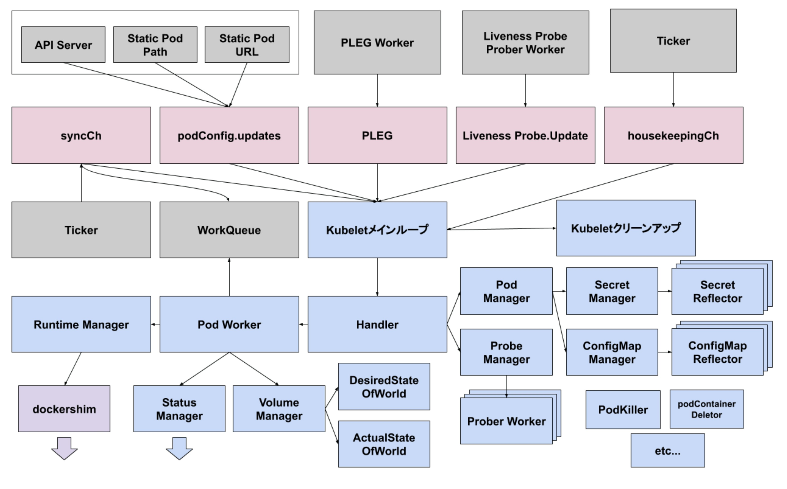
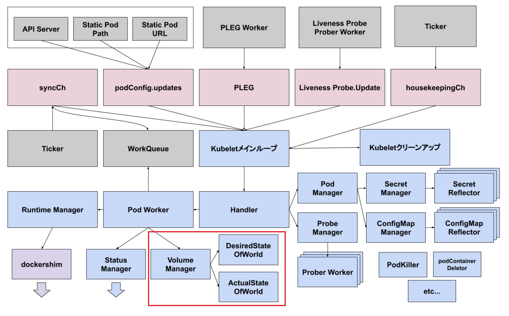
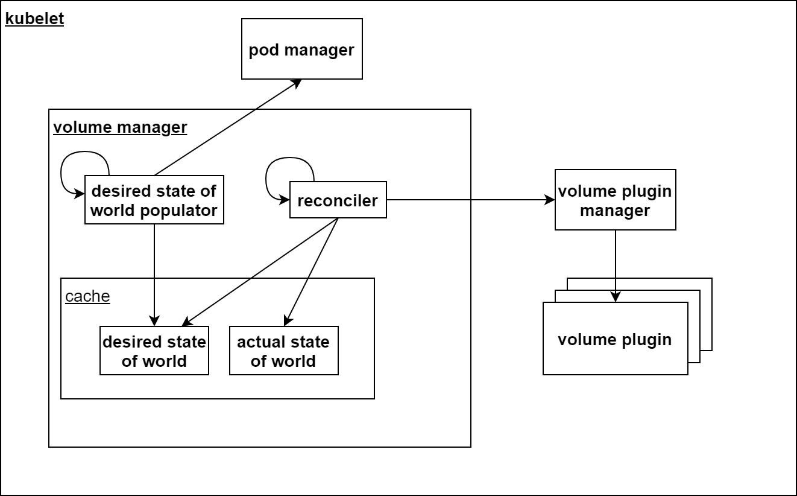

background-image: url(https://raw.githubusercontent.com/kyohmizu/items-for-presentation/master/bg-06.jpg)
background-size: cover
class: center, middle, white 
## VolumePluginの仕組みと実装解説

---
### whoami

.left-small[
    
]

.right-large[

```yaml
name: "Kyohei Mizumoto"
role: "SRE"
interests:
- "kubernetes"
- "public cloud"
- "golang"
twitter: "@kyohmizu"
```

]

---
### 今日話すこと

.zoom2[
.tmp[
- VolumePluginの概要
]

.tmp[
- Volume作成の仕組み
]

.tmp[
- 実装解説
  - VolumeManager
  - VolumePlugin (emptyDir/ConfigMap/Secret)
]
]

---
### 注意点

.zoom2[
.tmp[
- kubernetes v1.20.2ベースでお話しします
]

.tmp[
- Linuxノードに直接作成するVolumeが対象です  
  (Windowsノード、CSI等は取り扱いません)
]
.tmp[
- 理解不足により内容に誤りがある可能性があります…！
]
]

---
### kubeletについて

.zoom2[
- こちらを参照  
<u>https://speakerdeck.com/bells17/kubelet</u>
]

---
### VolumePluginについて

.zoom2[
.tmp[
- kubelet内で動作するPlugin
]

.tmp[
- pod.spec.volumesに基づいてノード上にVolumeを作成する
]

.tmp[
- Volumeの種類ごとにPluginが用意されている  
<u><https://kubernetes.io/docs/reference/generated/kubernetes-api/v1.20/#volume-v1-core></u>
]
]
---
class: center, middle 
## Volume作成の仕組み

---

.half-4[
<center></center>
]

.zoom0-r[
引用：<u><https://speakerdeck.com/bells17/kubelet?slide=17></u>
]

---

<center></center>

---

<center></center>

---
## Volume作成の仕組み

.zoom2[
.tmp[
- desired state of world  
ノードに作成・アタッチすべきVolume一覧
]

.tmp[
- actual state of world  
ノードに作成・アタッチされたVolume一覧
]

.tmp[
- desired state of world populator  
ノードにスケジュールされたPod一覧からdswを更新する
]

.tmp[
- reconciler  
dswとaswを比較し、未作成のVolumeの作成とaswの更新を行う
]
]


---
class: center, middle 
## 実装解説

---
### 実装解説

.zoom2[
.tmp[
- VolumePlugin定義
]

.tmp[
- 初期化 (kubelet起動時)
]

.tmp[
- Volume作成の流れ
]

.tmp[
- VolumePluginの実装
  - emptyDir
  - ConfigMap
  - Secret
]
]

---
### 実装解説

.zoom2[
.tmp[
- emptyDir/ComfigMap/Secretの保存パスについて
]

.tmp[
- Secretはメモリ上(tmpfs)に作成される
]

.tmp[
- ComfigMap/Secretの動的更新と修復
]

.tmp[
- emptyDirのv1.20での修正内容
]
]

---
### 実装解説

.zoom01[
- 資料のリンク  
<u><https://gist.github.com/kyohmizu/23ab1e76ebc2a2984694b144a0be9b78></u>
]
